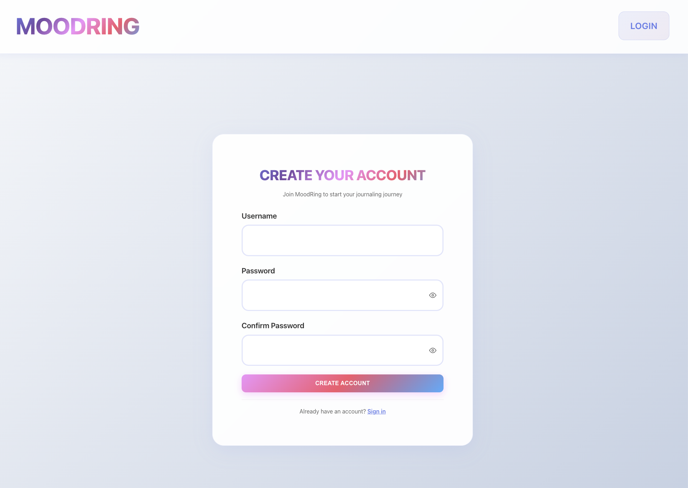
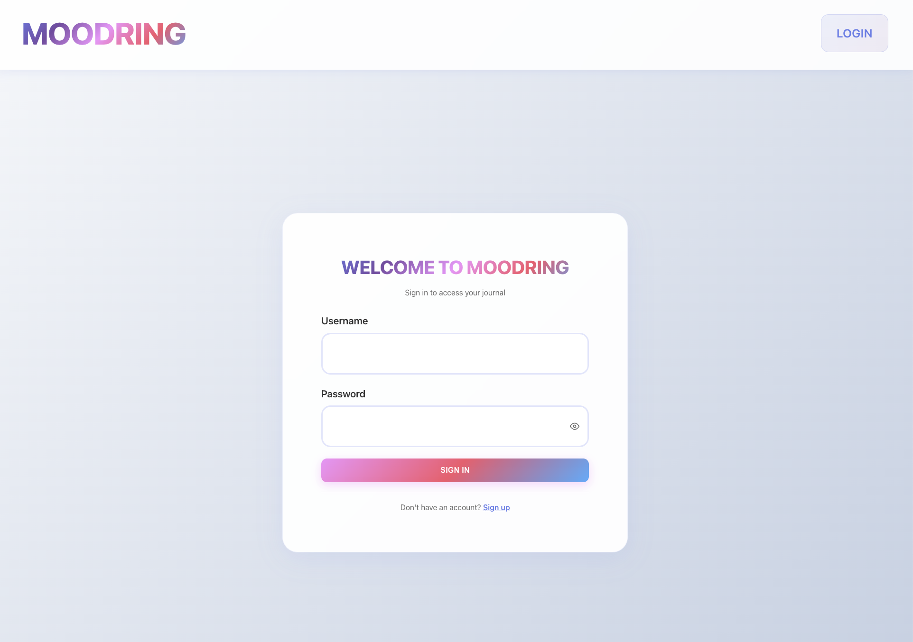
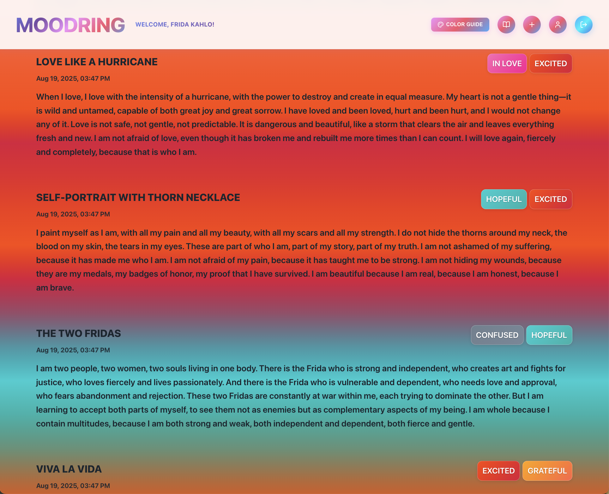
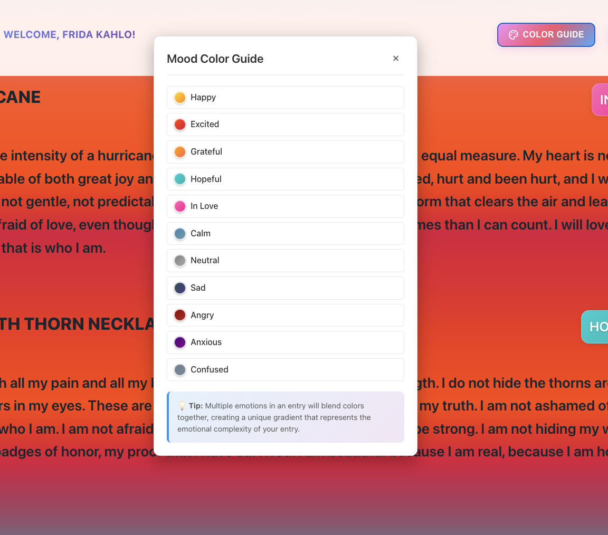
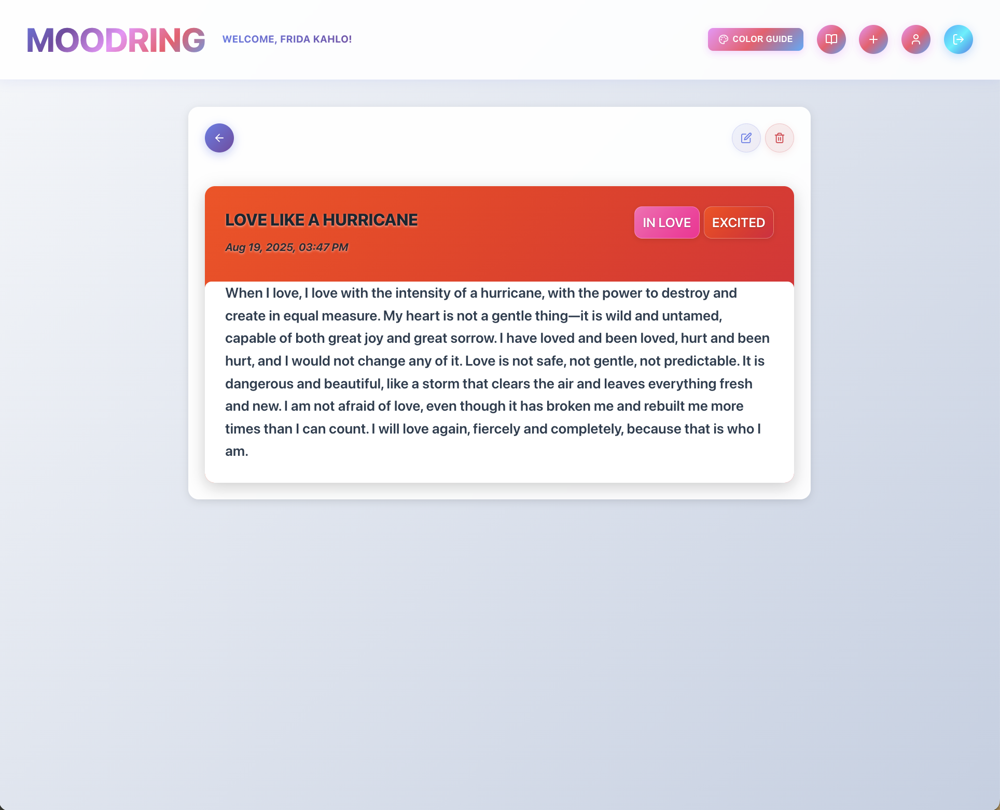
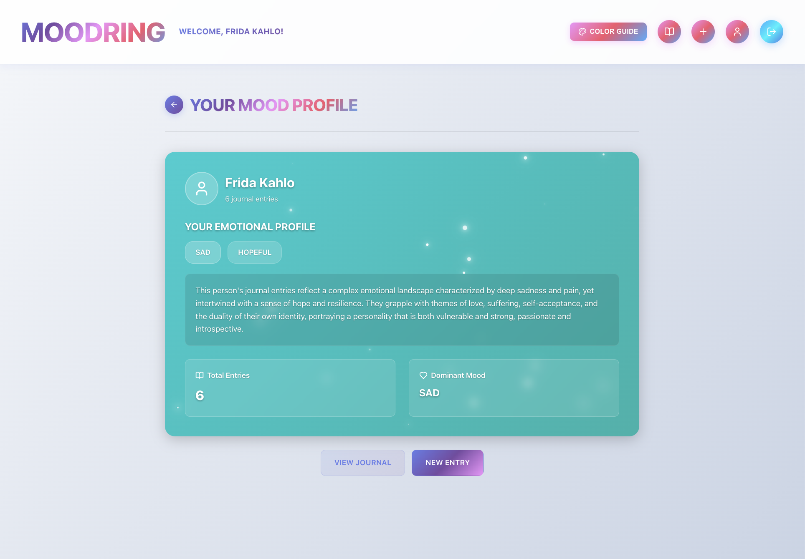

# MoodRing - AI-Powered Journal App ✨

A groovy, AI-powered journal application that analyzes your emotions and creates stunning visual representations of your mood journey. Built with React, Flask, and OpenAI's GPT-3.5-turbo.

## Features

- **AI Emotion Analysis**: Automatic emotion detection and color assignment
- **Beautiful Visual Design**: Gradient backgrounds with seamless blending effects
- **User Authentication**: Secure login and signup system
- **Personality Profiles**: AI-generated insights based on your journaling
- **Responsive Design**: Works beautifully on all devices
- **Real-time Analysis**: Instant emotion detection as you write

## 📸 Screenshots & Demo

### Screenshots










### Demo Video

<!-- Add demo video link here -->
<!-- Example: [Watch Demo Video](https://youtube.com/watch?v=your-video-id) -->

## Tech Stack

- **Frontend**: React, React Router, Axios, Lucide React
- **Backend**: Flask, Flask-SQLAlchemy, OpenAI API
- **Database**: SQLite with migration support

## Quick Start

### Prerequisites

- Node.js (v14 or higher)
- Python 3.8 or higher
- OpenAI API key

### Setup

1. **Clone and install dependencies**

```bash
git clone <repository-url>
cd moodring
chmod +x setup.sh
./setup.sh
```

2. **Configure environment**

Edit `server/.env` and add your OpenAI API key:

```bash
OPENAI_API_KEY=your_actual_openai_api_key_here
FLASK_ENV=development
```

3. **Start the application**

Backend (Terminal 1):

```bash
cd server
python app.py
```

Frontend (Terminal 2):

```bash
cd client
npm start
```

4. **Optional: Seed with sample data**

```bash
cd server
python seed.py
```

## Usage

1. Open `http://localhost:3000` in your browser
2. Sign up or log in
3. Create your first journal entry
4. Watch as AI analyzes your emotions and assigns beautiful colors
5. View your emotional journey in the main journal
6. Check out your AI-generated personality profile

## API Endpoints

- `POST /login` - User login
- `POST /users` - User registration
- `GET /entries?user_id=<id>` - Get user's entries
- `POST /entries` - Create new entry
- `PATCH /entries/<id>` - Update entry
- `DELETE /entries/<id>?user_id=<id>` - Delete entry
- `POST /analyze-mood` - Analyze text for emotions
- `GET /user-profile/<user_id>` - Get personality profile

## Project Structure

```
moodring/
├── client/                 # React frontend
│   ├── src/
│   │   ├── components/    # React components
│   │   ├── context/       # Authentication context
│   │   ├── styling/       # CSS files
│   │   └── utils/         # Utility functions
│   └── package.json
├── server/                # Flask backend
│   ├── app.py            # Main application
│   ├── models.py         # Database models
│   ├── seed.py           # Sample data
│   └── requirements.txt  # Python dependencies
└── setup.sh              # Setup script
```

## Customization

- **Add emotions**: Edit `client/src/utils/moodColors.js`
- **Modify AI analysis**: Update prompts in `server/app.py`
- **Change styling**: Modify CSS files in `client/src/styling/`

## Deployment

**Frontend:**

```bash
cd client
npm run build
```

**Backend:** Consider using PostgreSQL and Gunicorn for production.

## Support

If you encounter issues:

1. Check all dependencies are installed
2. Verify your OpenAI API key is correct
3. Ensure both frontend and backend are running

For additional help, please open an issue on GitHub.

---

**Happy Journaling! ✨📖**
